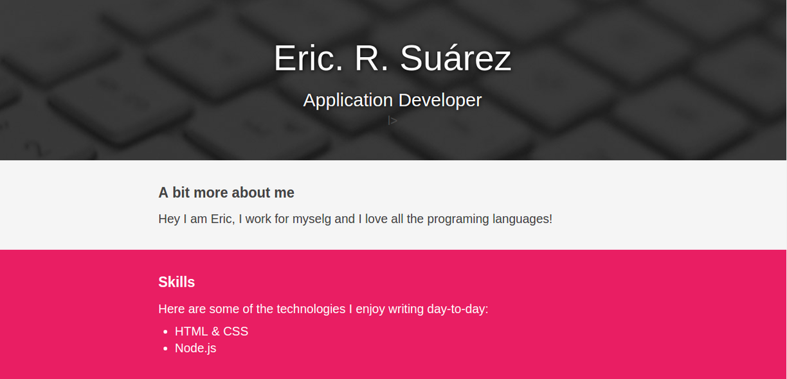

# Semantic HTML Portfolio

## Description 

This is a Portfolio based on the HTML semantic tags, using only html and css. Not frameworks.
This repo is based in a codeschool project. [See the Demo on codeschool](https://codeschool-project-demos.github.io/SemanticHTMLPortfolioProject/)

## Screen

## Live Demo

If you want see the demo in the gh-pages [Follow this link](https://ericrsuarez.github.io/SemanticHTMLPortfolioProject/) 
